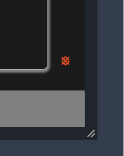
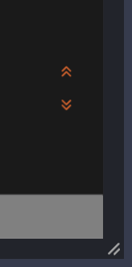
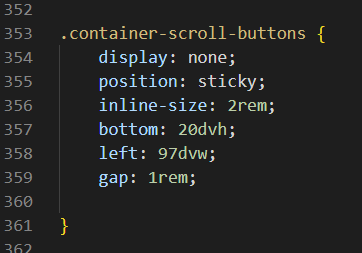

## Student-X

## Introduction

The idea for this website was not the first thing that came to my mind. I thought, after seeing some examples of project websites, that they were all good examples, some with a real connection, others describing a hobby or even fictitious companies. I said to myself, 'OK, you can do that, you can still do that at the age of 50. So I started to think about what I could do. Something unusual like a traditional recipe from my home country or a page about a museum or a person. After doing some research on various topics, I came up with the following.

- Who am I? 
- Why am I doing this course?
- Where do I want it to take me?
- How can I motivate others to do it?

  I am 50 years old, Generation X.  
  So I am student X.
  And that's how the idea for this site was born.

The purpose of the website is to provide information about front-end development as a career path and possibly motivate others with the idea of a career change at 45+.

In terms of content, the site provides a brief overview of HTML, CSS, and JavaScript. Overall, the site presents front-end development as a fulfilling and successful career path that combines demand, creativity, learning, collaboration and impact.

The live link can be found here - [\[Student-X\]](https://lorenz-127.github.io/Student-X/)

## Features

### Existing Features

For some/all of your features, you may choose to reference the specific project files that implement them.
In addition, you may also use this section to discuss plans for additional features to be implemented in the future:

### Menu Toggle

  - This function is intended to improve the user experience on mobile devices and tablets.
  - Even though it is a common practice here to use an icon from e.g. Fontawesome, I decided to create the burger buttons with vanilla CSS.
  - To do this, I gave three span elements the necessary styling in CSS.
  - On mobile devices, the menu button allows the navigation bar to slide in vertically in a narrow version so as not to cover the entire screen.
  - On tablets, the navigation bar slides in horizontally to cover as little of the content as possible.
  - On devices larger than 992px, the menu button disappears, and the navigation is traditionally displayed in the header.
  - The navigation bar is also slightly indented on very large screens to achieve a better display.

### Scroll To Top and Bottom - Button

  - Designed in the Main Colour Theme of HTML, CSS, and JavaScript Brand colours
  - The Element presents him self in the HTML Colours due to his position in an HTML element.
  - “On Hover” The Button becomes his action Colours for style and function represented by Background-colour of JavaScript and icon-Colour of CSS. 
  - Even if the function was not implemented with JavaScript, it is still a suitable analogy to the basic interaction of the three components.
  - In addition I added a scroll-behavior of smooth so that the page can be better perceived.

### Quiz Form
  
   LMS  The Essentials  Checkbox and Radio Inputs  Radio Button
    

### Features Left to Implement
  - 

#### Theme toggle
  - The idea is that the user can switch between dark and light mode.
    In the associated script In addition, it can be specified that the selected theme 
    is saved to local-storage so that the user does not have to switch again the next time visit.

#### Language toggle
  - It is planned to make the site available in other languages ​​as well. For example, in German.
    To point out that the Agentur für Arbeit supports such qualifications with an Bildungsgutschein.

#### Html / CSS / JS pages
  - The idea is to integrate a mini code editor into the respective page, so that the user can 
    practice directly in order to increase the motivation to do a retraining, and thus show that they can also do it.

#### Quiz form
  - The quiz should send an evaluation of the answers to the server and produce a result.
    This is displayed on the confirmation page, with a motivational text that confirms 
    that you are suitable for retraining as a software developer.

## Testing

In this section, you need to convince the assessor that you have conducted enough testing to legitimately believe that the site works well. Essentially, in this part you will want to go over all of your project’s features and ensure that they all work as intended, with the project providing an easy and straightforward way for the users to achieve their goals.

In addition, you should mention in this section how your project looks and works on different browsers and screen sizes.

You should also mention in this section any interesting bugs or problems you discovered during your testing, even if you haven't addressed them yet.

If this section grows too long, you may want to split it off into a separate file and link to it from here.

### Validator Testing

#### Wave
- redundant links in navbar
  - solution - add different alt description to the effected links

#### Lighthouse

#### HTML
  -  [W3C validator]
#### CSS
  -  [(Jigsaw) validator]

### Solved Bugs

- Issue 01 - The first grid layout didn't work as desired.
  - Solution: - Change the design to Flexbox.
- Issue 02 - The Elements in the footer have not aligned correctly.
  - Solution: - Add the display: felx property to the correct parent element.
- Issue 03 - The Navbar-links caused an overflow to the right on mobile screen.
  - Solution - The vw property was set wrong for the navbar-links.
- Issue 04 - The hidden checkbox in the header to control the menu bar via the burger icon causes the menu links to shift to the right when clicking in the header area on larger screens (laptop and up).
  - Solution: - Add class container-header to prevent elements 'floating' around
- Issue 05 - The Label color change for the correct / wrong answers on the Quiz form is not working.
  - Solution - Add the correct sibling selector in css and add the correct class to html element and restructure label/input.
- Issue 06 - Accessibility evaluation shows that the custom burger menu has a missing label
  - Solution: - Add an Aria-Label to the custom burger menu.
- Issue 07 - The Buttons To Top and Bottom are misaligned on small responsive devices.

  - Solution - Add Flexbox parent container to align the buttons correctly to display them the same on all devices.
 
- Issue 08 - The confirmation page shows the wrong style and scroll button alignment.
  - Solution - Add correct class name to parent container of the Scroll buttons.
- Issue 09 The quiz form do not uncheck radio buttons after selecting the next button.

  - Solution - Set the correct name attribute on input and label values

 

### Unfixed Bugs

## Deployment

The website was deployed using GitHub Pages by following these steps:

- The site was deployed to GitHub pages. The steps to deploy are as follows:
  1. In the GitHub repository, navigate to the Settings tab
  2. From the source section drop-down menu, select the Master Branch
  3. Once the main branch has been selected, the page will be automatically refreshed with a detailed ribbon display to indicate the successful deployment.

The live link can be found here - [Student-X](https://lorenz-127.github.io/Student-X/)

## Credits

### Styles, Icons, Images

- The fonts "Montserrat" and "Work Sans" are provided by [Google Fonts](https://fonts.google.com/?hl=en)
- The used Icons are from [fontawesome.com](https://fontawesome.com/icons)
- The favicon was generated with the provided tool by [favicon.io ](https://favicon.io/favicon-generator/)
- The Snapshots are from this Website's Code and made by my self with the Code Snapshot VS Code Desktop Plugin
- The image [Coffee Mug Surrounded With Coffee Beans](https://www.pexels.com/photo/coffee-mug-surrounded-with-coffee-beans-585753/) is  from [Toni Cuenca](https://www.pexels.com/@ifreestock/) und free to use CC license on [pexels.com](https://www.pexels.com/)

### JavaScript
- For the idea of the digital clock, as an example for the JavaScript part, I was inspired by the [GreatStack's](https://youtu.be/5tC46h022YE) YouTube channel. 
  I have specifically adapted the design and functionality for this website. 
  I have also re-written the script a bit differently to better suit my needs for this sites purpose and provide a more instructive example.

### Confirmation Page
- The video at the confirmation page is embed from Code Institute [YouTube Channel](https://www.youtube.com/@CodeinstituteNet)
- The Link to the 5-day-coding-challenge leads direct to the origin site on Code Institute [Free Coding Course](https://codeinstitute.net/de/5-day-coding-challenge/)
- The Link to the Article written by Ciara McGlynn leads direct to the origin site on Code Institutes 
  [Blog Career Change](https://codeinstitute.net/de/blog/why-is-it-important-to-learn-programming/) why is it important to learn programming.

### Content

#### Slide-in navbar and Burger menu
- The inspiration for these two features came to me during class. On the one hand, I wanted a burger menu, but not a copy of the Love Running   tutorial. I also wanted to avoid a simple solution with JavaScript and implement the function with vanilla CSS. From the lesson on UX design, I then had the idea for the slide-in menu to deviate sufficiently from the original from the walkthrough project. 
    I got the inspiration from [W3School](https://www.w3schools.com/howto/howto_js_sidenav.asp) and this is my attempt to implemented it without JavaScript.

#### "Scroll To Top" Button
  - This feature caught my attention when looking through example projects, shown by our cohort facilitator, where such a button was missing, in addition I added a scroll smooth so that the page can be better perceived. Again, I found what I was looking for on [W3School](https://www.w3schools.com/howto/howto_js_sidenav.asp). There was only one example with JavaScript, but it gave me enough information to implement the element myself in vanilla CSS.

#### Text Content
  - The text for the articles relating to career change is paraphrased by me, with inspiration from the site [claremontconsulting.com](https://www.claremontconsulting.com/why-become-a-front-end-developer#:~:text=Front-end%20developers%20have%20a,digital%20products%20is%20incredibly%20rewarding)
  - In addition, there is some content from the Code Institute [Career Support](https://codeinstitute.net/de/career-hub/?_gl=1*4muh7x*_up*MQ..*_ga*MTg0OTgxNjY4Mi4xNzE0NjY4Njc1*_ga_QFGPY7G0M3*MTcxNDY2ODY3NC4xLjAuMTcxNDY2ODY3NC4wLjAuNzQzNDk5MTc1) Website. These texts were also paraphrased by me and adapted to the needs of the website.

#### Quiz Form
  - LMS HTML The Essentials  Checkbox and Radio Inputs  Radio Button

#### Sign-up Form
  - LMS HTML The Essentials Coders Coffeehouse - Form Validation

### Acknowledgements

- My Peers in various Code Institute's Slack channels for their feedback and support.
- All the great videos that are periodically posted by slack-bot in the various (You're a legend!)

### Honourable mentions

- I would like to thank my mentor Luke Buchanan, who adapted to my learning pace

- Vernell for his valuable and patient advice and tips to find the right solution. [LinkedIn](https://www.linkedin.com/in/vernellclark/) [GitHub](https://github.com/VCGithubCode)
- Dimitris for his moral and technical support [LinkedIn](https://www.linkedin.com/in/dimitrios-thlivitis/) [GitHub](https://github.com/Dimitris112)

## Other General Project Advice

Below you will find a couple of extra tips that may be helpful when completing your project. Remember that each of these projects will become part of your final portfolio so it’s important to allow enough time to showcase your best work!

- One of the most basic elements of keeping a healthy commit history is with the commit message. When getting started with your project, read through [this article](https://chris.beams.io/posts/git-commit/) by Chris Beams on How to Write  a Git Commit Message
  - Make sure to keep the messages in the imperative mood

- When naming the files in your project directory, make sure to consider meaningful naming of files, point to specific names and sections of content.
  - For example, instead of naming an image used ‘image1.png’ consider naming it ‘landing_page_img.png’. This will ensure that there are clear file paths kept.

- Do some extra research on good and bad coding practices, there are a handful of useful articles to read, consider reviewing the following list when getting started:
  - [Writing Your Best Code](https://learn.shayhowe.com/html-css/writing-your-best-code/)
  - [HTML & CSS Coding Best Practices](https://medium.com/@inceptiondj.info/html-css-coding-best-practice-fadb9870a00f)
  - [Google HTML/CSS Style Guide](https://google.github.io/styleguide/htmlcssguide.html#General)

Getting started with your Portfolio Projects can be daunting, planning your project can make it a lot easier to tackle, take small steps to reach the final outcome and enjoy the process!