## Student-X

## Introduction

The purpose of the website is to provide information about front-end development as a career path and possibly motivate others with the idea of a career change at 45+.

In terms of content, the site provides a brief overview of HTML, CSS, and JavaScript. Overall, the site presents front-end development as a fulfilling and successful career path that combines demand, creativity, learning, collaboration and impact.

### The live link can be found here - [\[Student-X\]](https://lorenz-127.github.io/Student-X/)

Link to [responsive Mockup](https://ui.dev/amiresponsive?url=https://lorenz-127.github.io/Student-X/index.html)
---
## CONTENTS

* [User Experience](#user-experience-ux)
  * [User Stories](#user-stories)

* [Design](#design)
  * [Colour Scheme](#colour-scheme)
  * [Typography](#typography)
  * [Wireframes](#wireframes)

* [Features](#features)
  * [General Features on Each Page](#general-features-on-each-page)
  * [Future Implementations](#future-implementations)
  * [Accessibility](#accessibility)

* [Technologies Used](#technologies-used)
  * [Languages Used](#languages-used)
  * [Frameworks, Libraries & Programs Used](#frameworks-libraries--programs-used)

* [Deployment & Local Development](#deployment--local-development)
  * [Deployment](#deployment)
  * [Local Development](#local-development)
    * [How to Fork](#how-to-fork)
    * [How to Clone](#how-to-clone)

* [Testing](#testing)

* [Credits](#credits)
  * [Code Used](#code-used)
  * [Content](#content)
  * [Media](#media)
  * [Acknowledgments](#acknowledgments)

## CONTENTS

### UX
#### Main Idea

The idea for this website was not the first thing that came to my mind. I thought, after seeing some examples of project websites, that they were all good examples, some with a real connection, others describing a hobby or even fictitious companies. I said to myself, 'OK, you can do that, you can still do that at the age of 50. So I started to think about what I could do. Something unusual like a traditional recipe from my home country or a page about a museum or a person. After doing some research on various topics, I came up with the following.

- Who am I? 
- Why am I doing this course?
- Where do I want it to take me?
- How can I motivate others to do it?

  I am 50 years old, Generation X.  
  So I am student X.
  And that's how the idea for this site was born.

#### User stories
- #### First-Time Visitor Goals
  - 
- #### Returning Visitor Goals
  -
- #### Frequent User Goals
  - 

#### Owner Goals
- #### First-Time Visitor Goals
  - 
- #### Returning Visitor Goals
  -
- #### Frequent User Goals
  - 

## Design

### Colour Scheme

- The idea for this colour scheme was to choose a dark theme, as I am a dark-mode advocate. In addition to the theme, I added the brand-colours of HTML, CSS, and JavaScript. There are also some additional colours, e.g. for the quiz for shadows and other utilities.

- The colour scheme is reflected in all pages and features. For example, the links to the pages are highlighted in the corresponding colour and the features such as the scroll button shows the HTML colour in its resting state, as it is an HTML element. However, as soon as it is actively used, the colour changes to JavaScript and CSS as the function and style is controlled by these parts. Even if the button works solely in vanilla CSS, the colours are appropriate.

### Typography

- The fonts for this project are from google fonts.
  - The Title Font is Montserrat the websafe font is Verdana and as fallback it would be sans-serif.

  

  - the Text Font is Work Sans the websafe font is Tahoma and the fallback would be sans-serif.

  

### Wireframes

#### Original Design

- These are my notes on the fly after the first grid design didn't work, and I had to change the layout on the spot.

#### Home
- Desktop

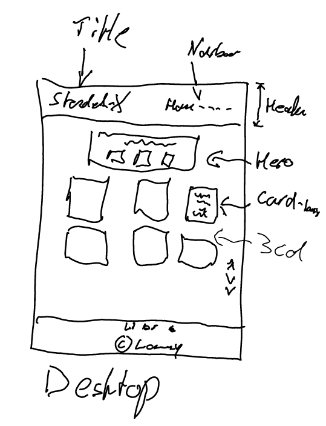

- Tablet

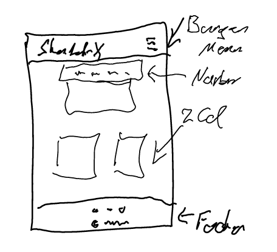

- Mobile

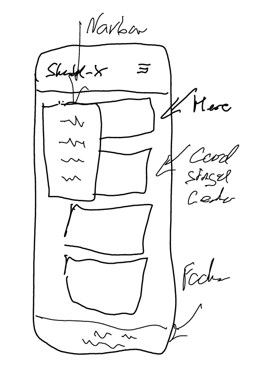

- To save some paper and the associated trees, I sketched the wireframes on my Re-Markable 2.

## Features

### Header
- 
- The header differs from larger to smaller screens.
- The navbar link shows the colour of the page the user is on.

  - On devices larger than 992px, the menu button disappears, and the navigation is traditionally displayed in the header.
  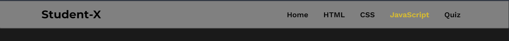

  - On tablets, the navigation bar slides in horizontally to cover as little of the content as possible.

  

  - On mobile devices, the menu button allows the navigation bar to slide in vertically in a narrow version so as not to cover the entire screen.

  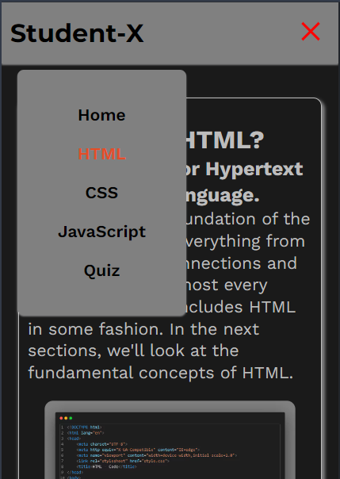

### Footer
- The footer stays consistence throughout the whole design on all devices and screen-sizes
- On hover the social media icons change their colour to the html utility colour.

### Home

- The home hero card box contains the 3 logos for HTML, CSS, and JavaScript, each of which leads to its corresponding page when clicked on hover.
- The homepage contains 5 reasons why a career change makes sense.

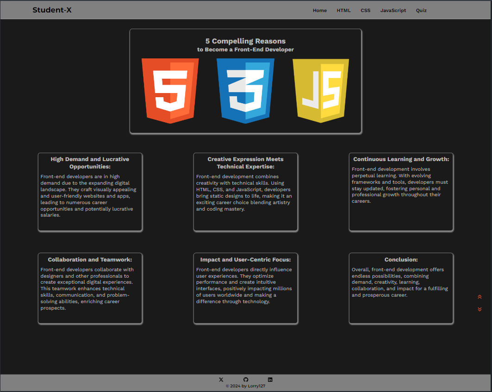

### HTML

- On the HTML page, a boilerplate HTML code is shown in a picture.
- The card boxes explain why HTML is useful to learn.
- The navbar link shows the associated colour to HTML as an indicator on which site the user is.

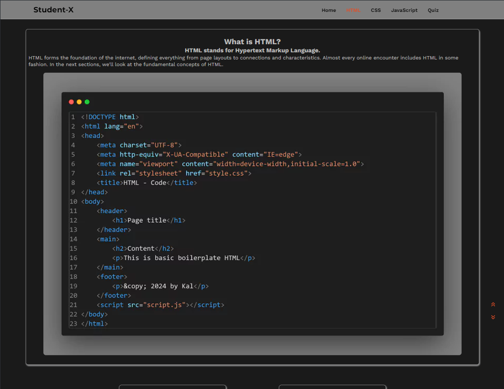
### CSS

- The CSS site also follows this concept.
- The navbar link shows the associated colour to CSS as an indicator on which site the user is.
- First, a short introduction to what CSS is,
- Then the basics of CSS are explained in a sample code.
- The code that is used in the screenshots originates from the website on which the user is visiting.

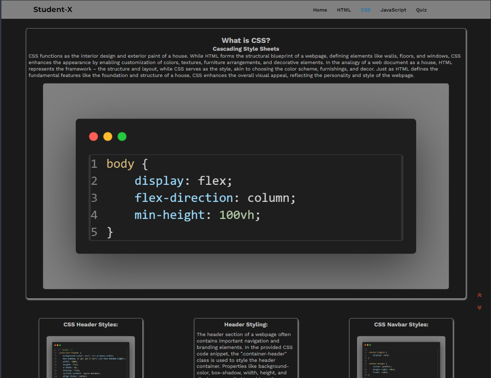

### JavaScript

- The JavaScript page first shows a digital clock in the Hero/Home card box, followed by the script for this displayed clock.
- The navbar link shows the associated colour to JavaScript as an indicator on which site the user is.
- In the card below the example of the script above is explained.
- This introduces the user to the basics of JavaScript.

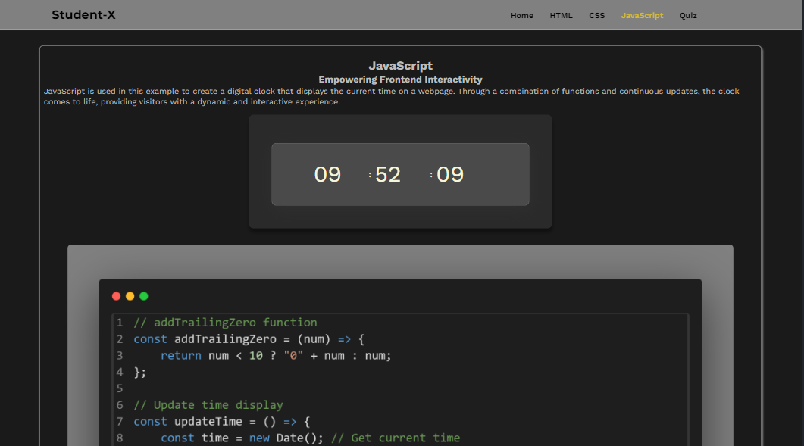

### Quiz

- The quiz is intended to be an interactive way for users to reflect on the content of the website through a playful approach.
- It is also intended to motivate users to find out more about front-end developers as a career change.

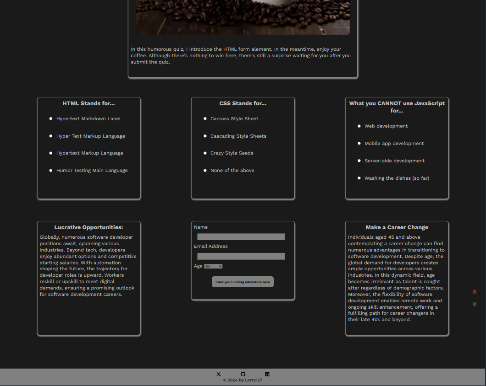

### Confirmation

- The confirmation page is intended as feedback for submitting the form.
- In addition, the page contains further call to action elements that are intended to introduce and motivate him further into the topic of career change.

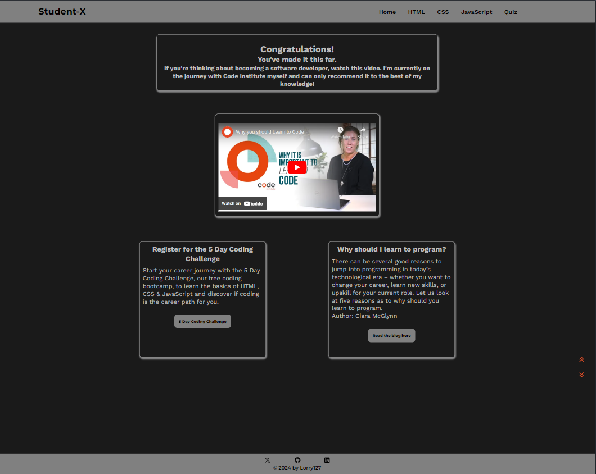

---

### Existing Features

For some/all of your features, you may choose to reference the specific project files that implement them.
In addition, you may also use this section to discuss plans for additional features to be implemented in the future:

### Menu Toggle

  - This function is intended to improve the user experience on mobile devices and tablets.
  - Even though it is a common practice here to use an icon from e.g. Fontawesome, I decided to create the burger buttons with vanilla CSS.
  - To do this, I gave three span elements the necessary styling in CSS.

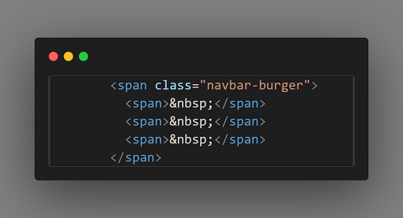

  - In addition, when clicked, the burger icon transforms into a red X to indicate to the user that they can also close the menu.

### Scroll To Top and Bottom - Button

  - Designed in the Main Colour Theme of HTML, CSS, and JavaScript Brand colours
  - The element presents itself in the HTML colors due to its position within an HTML element.

  - “On Hover” The Button becomes his action Colours for style and function represented by Background-colour of JavaScript and icon-Colour of CSS.
  - Another small detail is the transform: translateY option, which shifts the icon by 4 pixels in the direction in which it is to be scrolled. 
  - To make this process more pleasant for the user, the movement is delayed by 200ms.

  - Even if the function was not implemented with JavaScript, it is still a suitable analogy to the basic interaction of the three components.
  - In addition I added a scroll-behavior of smooth for the entire page so that the page can be better perceived.

### Buttons call to action / Submit

  - The Button present himself in the overall colour theme.

  - The style of the buttons is set as a global rule, so it applies to all buttons.

  - On-hover the button, inverse the Colours to give the user a visual response on action.

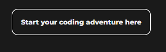

### radio button quiz

- The answers are highlighted in colour when clicked on, so that a visual engagement with the user is also created here.
- The colours represent whether the user's answer is correct (in green) or incorrect (in red).

- All elements are focusable with keyboard to make the page as accessible as possible.

### submit form with dropdown

- The form is a call to action. 
- The name and email address fields are kept simple to minimise the user's need to submit the form.
- With the dropdown, the user can set his age group and is motivated to learn more about software programming with the button. 

### Video from CI

- The whole website aims to show that changing careers is a good choice even in your mid-40s. This video is ideal to increase this motivation.
- The video is also responsive and available on all common devices.

### Further call to action

- The two card boxes below the video ask the user one last time for further information 
  in the form of the blog, or even to register for the 5dcc. 
- Both links lead directly to the respective content on the CI website in a new tab.

### Accessibility

- I used alt="", aria-labels and semantic elements like as much as possible to make the site easy to navigate and understand by keyboard and/or screen reader users.
- I made a small compromise with the HTML, CSS, and JavaScript pages. 
- The colours on the links to the respective pages are part of the colour concept of the website. 
- However, these three links resulted in a poor contrast rating but overall a minimal change in the overall accessibility rating.
- Also, the digital numbers from the clock example are made of text elements, which is not ideal for screen readers.
- The rating is never less than 94% on all pages.

### Features Left to Implement

#### Theme toggle
  - The idea is that the user can switch between dark and light mode.
    In the associated script In addition, it can be specified that the selected theme 
    is saved to local-storage so that the user does not have to switch again the next time visit.

#### Language toggle
  - It is planned to make the site available in other languages ​​as well. For example, in German.
    To point out that the Government supports such qualifications with an education voucher.

#### Html / CSS / JS embedded code editor
  - The idea is to integrate a mini code editor into the respective page, so that the user can 
    practice directly in order to increase the motivation to do a retraining, and thus show that they can also do it.

#### Quiz form
  - The quiz should send an evaluation of the answers to the server and produce a result.
  - This is displayed on the confirmation page, with a motivational text that confirms 
    that you are suitable for retraining as a software developer.

## Testing

- [Link to testing.md](testing.md)

In this section, you need to convince the assessor that you have conducted enough testing to legitimately believe that the site works well. Essentially, in this part you will want to go over all of your project’s features and ensure that they all work as intended, with the project providing an easy and straightforward way for the users to achieve their goals.

In addition, you should mention in this section how your project looks and works on different browsers and screen sizes.

You should also mention in this section any interesting bugs or problems you discovered during your testing, even if you haven't addressed them yet.

If this section grows too long, you may want to split it off into a separate file and link to it from here.

### Bug Fixes in the Production Process

- Issue 01 - The first grid layout didn't work as desired.
  - Solution: - Change the design to Flexbox.
- Issue 02 - The Elements in the footer have not aligned correctly.
  - Solution: - Add the display: felx property to the correct parent element.
- Issue 03 - The Navbar-links caused an overflow to the right on mobile screen.
  - Solution - The vw property was set wrong for the navbar-links.
- Issue 04 - The hidden checkbox in the header to control the menu bar via the burger icon causes the menu links to shift to the right when clicking in the header area on larger screens (laptop and up).
  - Solution: - Add class container-header to prevent elements 'floating' around
- Issue 05 - The Label color change for the correct / wrong answers on the Quiz form is not working.
  - Solution - Add the correct sibling selector in css and add the correct class to html element and restructure label/input.
- Issue 06 - Accessibility evaluation shows that the custom burger menu has a missing label
  - Solution: - Add an Aria-Label to the custom burger menu.
- Issue 07 - The Buttons To Top and Bottom are misaligned on small responsive devices.
  - Solution - Add Flexbox parent container to align the buttons correctly to display them the same on all devices.
- Issue 08 - The confirmation page shows the wrong style and scroll button alignment.
  - Solution - Add correct class name to parent container of the Scroll buttons.
- Issue 09 The quiz form do not uncheck radio buttons after selecting the next button.

  - Solution - Set the correct name attribute on input and label values
  

### Bug Fixes through after validation

- Issues V-1 Stray end tag on line 80 confirmation page

  - Solution: Delete stray end tag 

- Issue V-2 Attribute alt not allowed on element a at this point.

  - Solution: Delete "alt" tag

- Issue V-3 Element div not allowed as child of element label in this context.

  - Solution: Set correct element span

- Issue V-4 Named character reference was not terminated by a semicolon.

  - Solution: Add correct semicolon character at the end

### Bug Fixes caused through changes after validation

### Unfixed Bugs

- Issue 10 Video does not align with other card-box containers on smaller screens

  - The video container does not have the same margin distance on smaller devices as the other card-box containers. 
    Error not yet fixed because this error has a lower priority due to the deadline. 

    I had a solution for the problem. But it did not pass the W3C validation. 
    Since I use a third-party code for the video in both cases, I leave it as it is and live with the error.

    The video is also 100% responsive with the code used, and therefore the UX is guaranteed.

# Deployment & Local Development

## Deployment

The site is deployed using GitHub Pages - [Student-X](https://lorenz-127.github.io/Student-X/)

To Deploy the site using GitHub Pages by following these steps:

1. Login (or signup) to Github.
2. Go to the repository for this project, [lorenz-127/Sudent-X](https://github.com/Lorenz-127/Student-X).
3. Click the settings button.
4. Select pages in the left hand navigation menu.
5. From the source dropdown select main branch and press save.
6. The site has now been deployed, please note that this process may take a few minutes before the site goes live.

## Local Development

### How to Fork

To fork the repository:

1. Log in (or sign up) to Github.
2. Go to the repository for this project, Lorenz-127/Student-X
3. Click the Fork button in the top right corner.

### How to Clone

To clone the the repository:

1. Log into your account on github
2. Go to the repository of this project /Lorenz-127/Student-X/
3. Click on the code button, and copy your preferred clone link.
4. Open the terminal in your code editor and change the current working directory to the location you want to use for the cloned directory.
5. Type 'git clone' into the terminal, paste the link you copied in step 3 and press enter.

# Credits

### Styles, Icons, Images

- The fonts "Montserrat" and "Work Sans" are provided by [Google Fonts](https://fonts.google.com/?hl=en)
- The used Icons are from [fontawesome.com](https://fontawesome.com/icons)
- The favicon was generated with the provided tool by [favicon.io ](https://favicon.io/favicon-generator/)
- The Snapshots are from this Website's Code and made by my self with the Code Snapshot VS Code Desktop Plugin
- The image [Coffee Mug Surrounded With Coffee Beans](https://www.pexels.com/photo/coffee-mug-surrounded-with-coffee-beans-585753/) is  
  from [Toni Cuenca](https://www.pexels.com/@ifreestock/) und free to use CC license on [pexels.com](https://www.pexels.com/)

### JavaScript
- For the idea of the digital clock, as an example for the JavaScript part, I was inspired by the [GreatStack's](https://youtu.be/5tC46h022YE) YouTube channel. 
  I have specifically adapted the design and functionality for this website. 
  I have also re-written the script a bit differently to better suit my needs for this sites purpose and provide a more instructive example.

### Confirmation Page
- The video at the confirmation page is embed from Code Institute [YouTube Channel](https://www.youtube.com/@CodeinstituteNet)
  - How to make YouTube Video responsive I found on [Paper Krane YouTube Channel](https://youtu.be/X4t0JxiBeO0)

- The Link to the 5-day-coding-challenge leads direct to the origin site on Code Institute [Free Coding Course](https://codeinstitute.net/de/5-day-coding-challenge/)
- The Link to the Article written by Ciara McGlynn leads direct to the origin site on Code Institutes 
  [Blog Career Change](https://codeinstitute.net/de/blog/why-is-it-important-to-learn-programming/) why is it important to learn programming.

### Content

#### Slide-in navbar and Burger menu
- The inspiration for these two features came to me during class. On the one hand, I wanted a burger menu, but not a copy of the Love Running   tutorial. I also wanted to avoid a simple solution with JavaScript and implement the function with vanilla CSS. From the lesson on UX design, I then had the idea for the slide-in menu to deviate sufficiently from the original from the walkthrough project. 
    I got the inspiration from [W3School](https://www.w3schools.com/howto/howto_js_sidenav.asp) and this is my attempt to implemented it without JavaScript.

#### "Scroll To Top and Bottom" Button
  - This feature caught my attention when looking through example projects, shown by our cohort facilitator, where such a button was missing, in addition I added a scroll smooth so that the page can be better perceived. Again, I found what I was looking for on [W3School](https://www.w3schools.com/howto/howto_js_sidenav.asp). There was only one example with JavaScript, but it gave me enough information to implement the element myself in vanilla CSS.

#### Text Content
  - The text for the articles relating to career change is paraphrased by me, with inspiration from the site [claremontconsulting.com](https://www.claremontconsulting.com/why-become-a-front-end-developer#:~:text=Front-end%20developers%20have%20a,digital%20products%20is%20incredibly%20rewarding)
  - In addition, there is some content from the Code Institute [Career Support](https://codeinstitute.net/de/career-hub/?_gl=1*4muh7x*_up*MQ..*_ga*MTg0OTgxNjY4Mi4xNzE0NjY4Njc1*_ga_QFGPY7G0M3*MTcxNDY2ODY3NC4xLjAuMTcxNDY2ODY3NC4wLjAuNzQzNDk5MTc1) Website. These texts were also paraphrased by me and adapted to the needs of the website.

### Acknowledgements

- My Peers in various Code Institute's Slack channels for their feedback and support.
- All the great videos that are periodically posted by slack-bot in the various channels (You're a legend!)

### Honourable mentions

- I would like to thank my mentor Luke Buchanan, who adapted on the spot to my learning pace.

- Vernell for his valuable and patient advice and tips to find the right solution. [LinkedIn](https://www.linkedin.com/in/vernellclark/) [GitHub](https://github.com/VCGithubCode)
- Dimitris for his moral and technical support [LinkedIn](https://www.linkedin.com/in/dimitrios-thlivitis/) [GitHub](https://github.com/Dimitris112)

## Most importantly:
### My wife, who encourages me in all my endeavours, and without her unwavering support, none of this would be possible.
