# Tests

### Manual Testing
  - [Lighthouse](#lighthouse)
  - [HTML](#html)
  - [External Testing](#external-testing)

### Validator Testing

#### Home

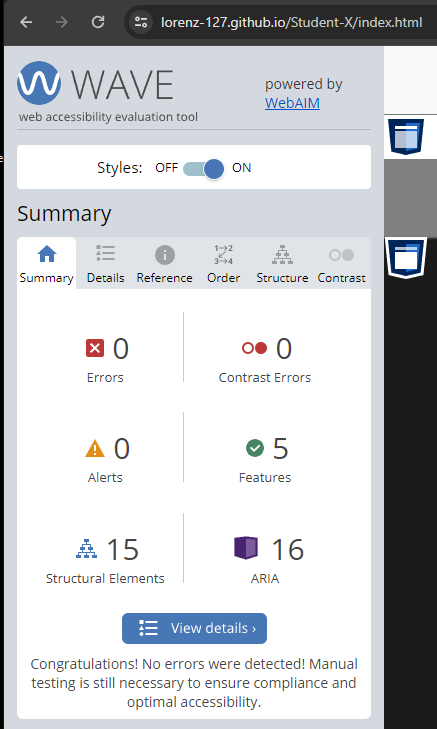

  - pass

#### HTML-Basics

  - The colours on the links to the respective pages are part of the colour concept of the website. 
  - However, these three links resulted in a poor contrast rating but overall a minimal change in the overall accessibility rating.
  - Also, the digital numbers from the clock example are made of text elements, which is not ideal for screen readers.
  - The rating is never less than 94% on all pages.
  - pass

#### CSS-Basics

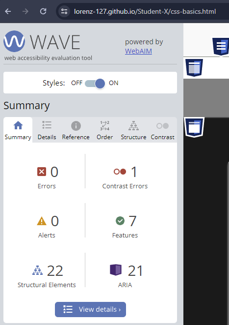

  - The colours on the links to the respective pages are part of the colour concept of the website. 
  - However, these three links resulted in a poor contrast rating but overall a minimal change in the overall accessibility rating.
  - Also, the digital numbers from the clock example are made of text elements, which is not ideal for screen readers.
  - The rating is never less than 94% on all pages.
  - pass

#### JS-Basics

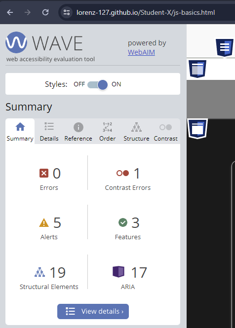

  - The colours on the links to the respective pages are part of the colour concept of the website. 
  - However, these three links resulted in a poor contrast rating but overall a minimal change in the overall accessibility rating.
  - Also, the digital numbers from the clock example are made of text elements, which is not ideal for screen readers.
  - The rating is never less than 94% on all pages.
  - pass

#### Quiz-Basics

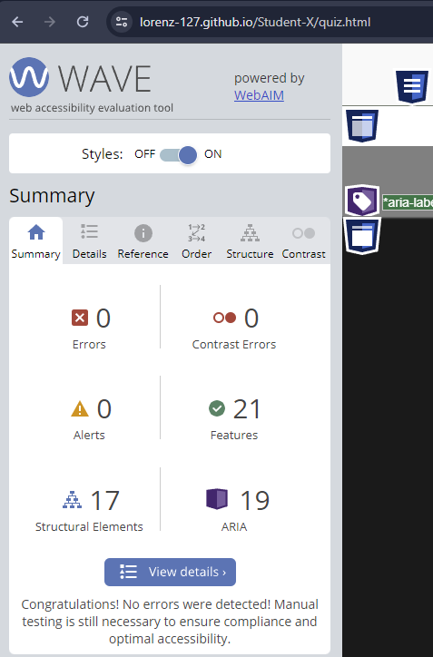

  - pass

#### Confirmation

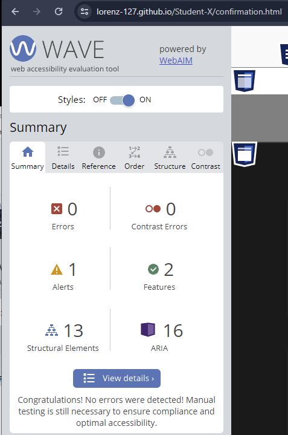

  - Alert for video content with audio, ensure that synchronized captioning is available.
  - The Video itself has CC aviable, therfore I ignore the alert.
  - pass

[Top](#tests)

### HTML

#### Home

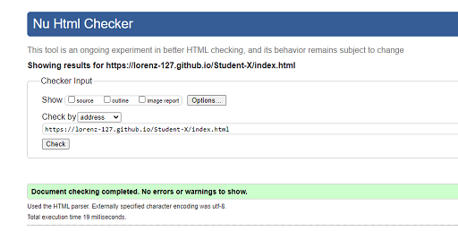

  - pass

#### HTML-Basics

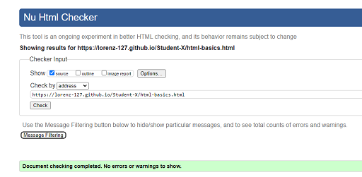

  - pass

##### CSS-Basics

  - pass

#### JS-Basics

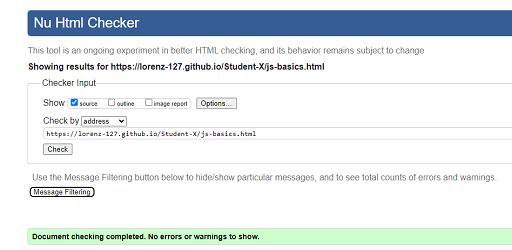

  - pass

#### Quiz-Basics

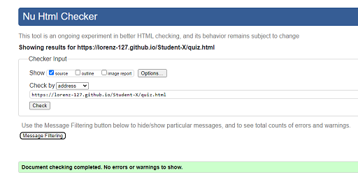

  - pass

#### Confirmation

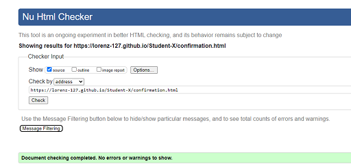

  - pass

#### CSS

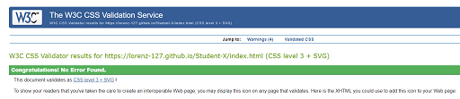

  - pass

#### Wave
- redundant links in navbar
  - solution - add different alt description to the effected links

[Top](#tests)

## Lighthouse

### Home

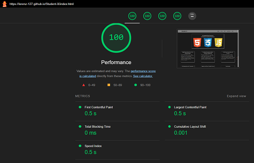

### HTML-Basics

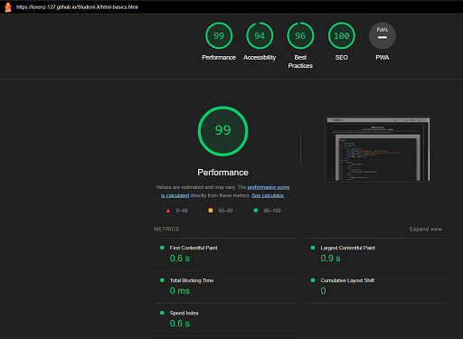

### CSS-Basics

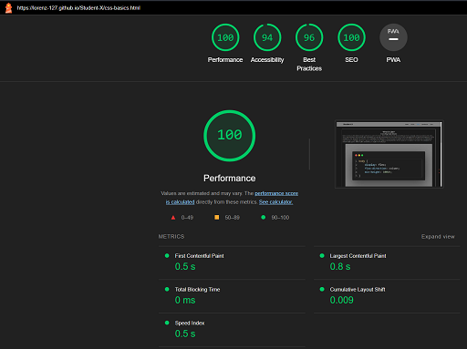

### JS-Basics

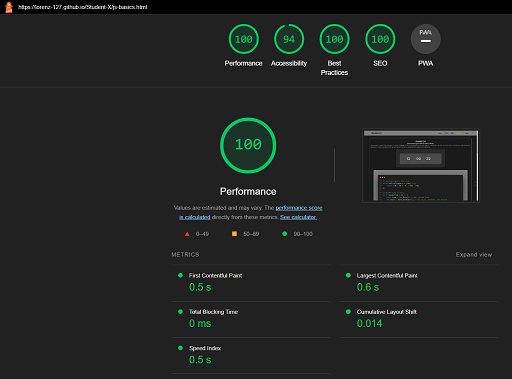

### Quiz-Basics

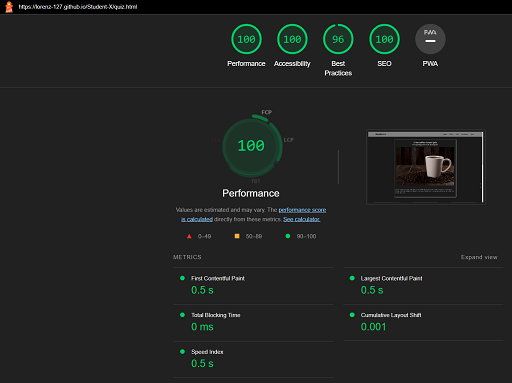

### Confirmation

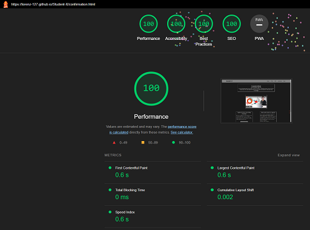

[Top](#tests)

## External Testing   

Additional testing was taken by friends and family on a variety of devices and screen sizes.

### Navbar

| Feature | Expected Outcome | Testing Performed | Result | Pass/Fail |
| --- | --- | --- | --- | --- |
| Title | When clicked the user will be redirected to the home page. | Clicked title | Redirected to the home page. | Pass |
| Home Page Link | When clicked the user will be redirected to the home page.| Clicked link | Redirected to the home page. | Pass |
| HTML Link | When clicked the user will be redirected to the home page.| Clicked link | Redirected to the home page. | Pass |
| CSS Link | When clicked the user will be redirected to the home page.| Clicked link | Redirected to the home page. | Pass |
| JavaScript Link | When clicked the user will be redirected to the home page.| Clicked link | Redirected to the home page. | Pass |
| Quiz Link | When clicked the user will be redirected to the home page.| Clicked link | Redirected to the home page. | Pass |
| Confirmation page | When clicked on the links the user will be redirected to respective page.| Clicked link | Redirected to the page. | Pass |

### Burger button

| Feature | Expected Outcome | Testing Performed | Result | Pass/Fail |
| --- | --- | --- | --- | --- |
| Burger button tablet | When clicked the navbar wil slide in horizontal to the top center direct under the header. | Clicked  burger button | Slide horizontal to the top center. | Pass |
| Burger button mobile | When clicked the navbar wil slide in vertical the top left under the header. | Clicked  burger button | Slide vertical the top left. | Pass |

### Navbar Link colours for HTML, CSS and JavaScript

| Feature | Expected Outcome | Testing Performed | Result | Pass/Fail |
| --- | --- | --- | --- | --- |
| HTML Link | When clicked the Link will show its HTML colour. | Clicked link | Show its HTML colour. | Pass |
| CSS Link | When clicked the Link will show its CSS colour. | Clicked link | Show its CSS colour. | Pass |
| JavaScript Link | When clicked the Link will show its JavaScript colour. | Clicked link | show its JavaScript colour. | Pass |

### Footer

| Feature | Expected Outcome | Testing Performed | Result | Pass/Fail |
| --- | --- | --- | --- | --- |
| Social Icons | When clicked the user will be redirected to the appropriate social media pages in a new window. | Clicked icon | Redirected to the social media page in a new window. | Pass |

### Scroll button

| Feature | Expected Outcome | Testing Performed | Result | Pass/Fail |
| --- | --- | --- | --- | --- |
| Scroll button top | When clicked the site will scroll to the top of the page. | Clicked arrow up | Scroll to the top. | Pass |
| Scroll button bottom | When clicked the site will scroll to the bottom of the page. | Clicked arrow down | Scroll to the bottom. | Pass |

### JavaScript Page

| Feature | Expected Outcome | Testing Performed | Result | Pass/Fail |
| --- | --- | --- | --- | --- |
| Clock | Clock shows on tablet and up and is working | on page load | Clock shows on up and is working. | Pass |
| Clock | Clock does not show on mobile | on page load | Clock does not show. | Pass |

### Quiz Page

| Feature | Expected Outcome | Testing Performed | Result | Pass/Fail |
| --- | --- | --- | --- | --- |
| Radio buttons Answer text | When clicked will show the correct answer colour | Clicked on the radio buttons or the answer text | Shows the correct colour for the answer | Pass |
| Submit Form Name | When left the fields blank required message shows up | Let field blank | Required message shows up | Pass |
| Submit Form Email | When left the fields blank required message shows up | Let field blank | Required message shows up | Pass |
| Submit Form Email | When submit invalid Email format required message shows up | Use wrong Email format | Required message shows up | Pass |
| Submit Form Dropdown | When fill out the fields required message shows up | Do not select | Required message shows up | Pass |
| Submit Button | When button clicked redirect to confirmation page | Click button | Redirect to confirmation page | Pass |

### Confirmation Page

| Feature | Expected Outcome | Testing Performed | Result | Pass/Fail |
| --- | --- | --- | --- | --- |
| YouTube video | Video does not autoplay only when clicked does it play. | Clicked video | Video plays | Pass |
| 5dcc Button | When button clicked redirect to external CI 5dcc page | Click button | Redirect to external CI 5dcc page | Pass |
| Blog Button | When button clicked redirect to external CI blog page | Click button | Redirect to external CI blog page | Pass |

[Top](#tests)
- - -