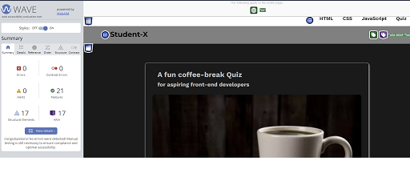

# Tests

## Manual Testing

### Validator Testing

#### HTML

  -  [W3C validator]

#### CSS

  -  [(Jigsaw) validator]

#### Wave
- redundant links in navbar
  - solution - add different alt description to the effected links

#### Lighthouse