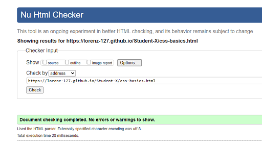

# Tests

## Manual Testing

### Validator Testing

#### Home

  - pass

#### HTML-Basics

  - The colours on the links to the respective pages are part of the colour concept of the website. 
  - However, these three links resulted in a poor contrast rating but overall a minimal change in the overall accessibility rating.
  - Also, the digital numbers from the clock example are made of text elements, which is not ideal for screen readers.
  - The rating is never less than 94% on all pages.
  - pass

#### CSS-Basics

  - The colours on the links to the respective pages are part of the colour concept of the website. 
  - However, these three links resulted in a poor contrast rating but overall a minimal change in the overall accessibility rating.
  - Also, the digital numbers from the clock example are made of text elements, which is not ideal for screen readers.
  - The rating is never less than 94% on all pages.
  - pass

#### JS-Basics

  - The colours on the links to the respective pages are part of the colour concept of the website. 
  - However, these three links resulted in a poor contrast rating but overall a minimal change in the overall accessibility rating.
  - Also, the digital numbers from the clock example are made of text elements, which is not ideal for screen readers.
  - The rating is never less than 94% on all pages.
  - pass

#### Quiz-Basics

  - pass

#### Confirmation

  - Alert for video content with audio, ensure that synchronized captioning is available.
  - The Video itself has CC aviable, therfore I ignore the alert.
  - pass

### HTML

#### Home

  - pass

#### HTML-Basics

  - pass

##### CSS-Basics

  - pass

#### JS-Basics

  - pass

#### Quiz-Basics

  - pass

#### Confirmation

  - pass

#### CSS

  - pass

#### Wave
- redundant links in navbar
  - solution - add different alt description to the effected links

## Lighthouse

### Home

### HTML-Basics

### CSS-Basics

### JS-Basics

### Quiz-Basics

### Confirmation

## External testing

Additional testing was taken by friends and family on a variety of devices and screen sizes.

| Feature | Expected Outcome | Testing Performed | Result | Pass/Fail |

| --- | --- | --- | --- | --- |

| `Navbar` |

| | | | | |

| Title | When clicked the user will be redirected to the home page. | Clicked title | Redirected to the home page. | Pass |

| Home Page Link | When clicked the user will be redirected to the home page.| Clicked link | Redirected to the home page. | Pass |
| HTML  Link | When clicked the user will be redirected to the home page.| Clicked link | Redirected to the home page. | Pass |
| CSS Link | When clicked the user will be redirected to the home page.| Clicked link | Redirected to the home page. | Pass |
| JavaScript Link | When clicked the user will be redirected to the home page.| Clicked link | Redirected to the home page. | Pass |
| Quiz Link | When clicked the user will be redirected to the home page.| Clicked link | Redirected to the home page. | Pass |
| Confirmation page | When clicked on the links the user will be redirected to respective page.| Clicked link | Redirected to the page. | Pass |

| --- | --- | --- | --- | --- |

| `Footer` |

| | | | | |

| Social Icons | When clicked the user will be redirected to the appropriate social media pages in a new window. | Clicked icon | Redirected to the social media page in a new window. | Pass |

| --- | --- | --- | --- | --- |

| `JavaScript Page` |

| | | | | |

| Clock | Clock shows on tablet and up and is working | on page load |  Clock shows on up and is working. | Pass |
| Clock | Clock does not show on mobile | on page load |   Clock does not show. | Pass |

| --- | --- | --- | --- | --- |

| `Quiz Page` |

| | | | |

| Radio buttons Answer text | When clicked will show the correct answer colour | Clicked on the radio buttons or the answer text | shows the correct colour for the answer | Pass |
| Submit Form Name | When left the fields blank required message shows up | let field blank | required message shows up | Pass |
| Submit Form Email | When left the fields blank required message shows up | let field blank | required message shows up | Pass |
| Submit Form Email | When submit invalid Email format required message shows up | Use wrong Email format | required message shows up | Pass |
| Submit Form Dropdown | When fill out the fields required message shows up | do not select | required message shows up | Pass |
| Submit Button | When button clicked redirect to confirmation page | click button | redirect to confirmation page | Pass |

| --- | --- | --- | --- | --- |

| `Confirmation page` |

| | | | |

| YouTube video | Video does not autoplay only when clicked does it play. | Clicked video | Video plays | Pass |
| 5dcc Button | When button clicked redirect to external CI 5dcc page | click button | redirect to external CI 5dcc page | Pass |
| Blog  Button | When button clicked redirect to external CI blog page | click button | redirect to external CI blog page | Pass |

| --- | --- | --- | --- | --- |

- - -